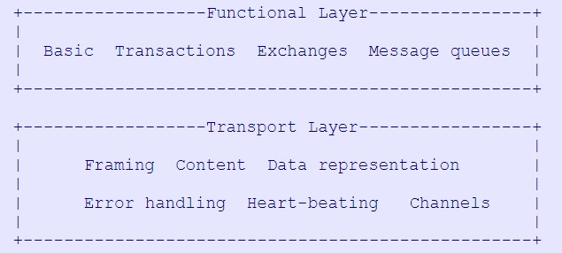
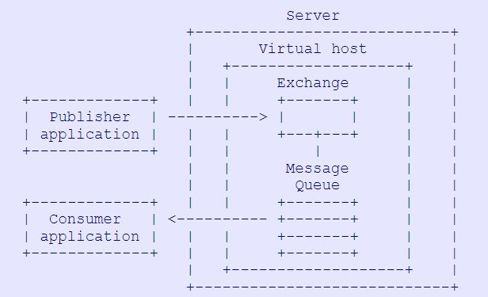
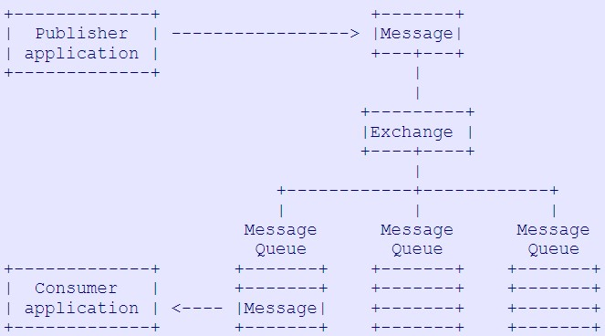
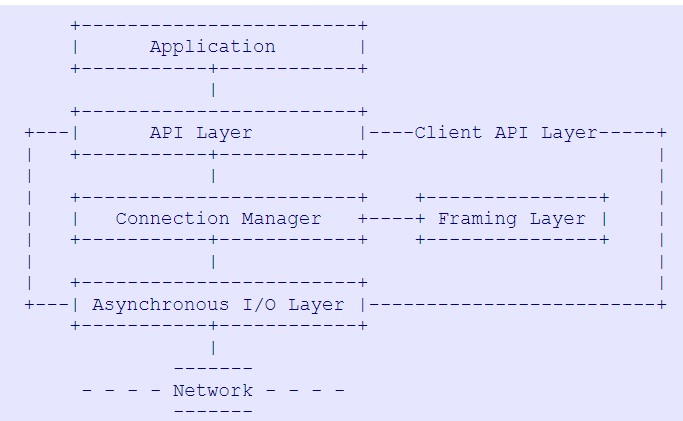

# 概览

本文基于AMQP v0.9.1 

## AMQP 解决了什么问题

> Our goal is to enable  the development and industry-wide use of standardised messaging middlewaretechnolog

> AMQP  creates full functional interoperability  between conforming clients and messaging middlewareservers (also called "brokers")

实现标准中间件应用的开发和工业范围内的应用。这将会降低企业系统整合的成本，并且为受众提供工业级的整合。

AMQP 实现了协议实现者和消息中间件之间的全功能互通性。

不同系统之间的互通性需要`网络协议`和明确语义的`服务端行为`共同协作。amqp既定义了网络协议也通过一些列组件（`AMQ model`）定义了消息传递的能力。

## AMQP 的层次结构


功能层定义了一些代表功能组合的客户端命令。
传输层在应用和服务之间传输方法，同时也处理通道复用，帧同步, 内容编码,心跳检测, 以及数据表示和错误处理。
和单向的RPC调用不同，AMQP的调用是双向的，应用可以向服务器发送命令，服务器也可以反过来。

传输层和功能层并不是紧密相关联的，可以在不改变功能层的情况下使用别的传输层来替代amqp的传输层，也可以将传输层应用到其他高级协议上。

## 其他

规模上的伸缩性，通过服务器纵向拓展能提供1 message/s到100k message/s的传输速度。
提供丰富的功能，包括一读多写的存储转发；多对多的负载均衡，发布订阅，基于内容的路由，队列文件传输；点对点连接；在多源多消费的情况下推销数据分布（Market data distribution with many sources and many readers）

# 总体架构

## 实体（AMQ Model）架构



我们可以总结一下消息中间件到底是一个什么东西，所谓消息中间件，其实做了两件事。它接受消息，然后根据各种规则路由给消费者。如果消费者暂时不能接收消息，那么它就会把消息在内存或者硬盘上缓存起来。

AMQ Model 通过两个组件来实现上面的功能:

- exchange 从生产者端接受消息，并且把消息路由给queue
- queue 暂存消息，并把消息发送给消费者

在 exchange 和 queue 之间还有一个接口，叫做 binding 。我们稍后再说这个组件。

AMQP 通过以下两种特性，提供了一种运行时可插拔的语义：

- 通过协议在运行期间创建 exchange 和 queue 的能力
- 通过协议在运行期间关联 exchange 和 queue 来满足系统内不同的消息投递需求

### 消息投递流程



#### 消息的生命周期

AMQP中的消息由一些属性和一个不透明的内容组成。新的消息是消息生产者应用通过AMQP的api产生的，生产者设置消息的一些属性，把要传递的主题放在内容里，在消息上打上关于路由信息的标签，所谓的路由信息就像一个地址。然后生产者把消息发送到中间件服务里的exchange上。

当消息到达服务器，exchange通常会把消息路由到同时存在在服务器中的一些消息队列里。如果没有合适的消息队列，根据生产者的设置，exchange可能会通知生产者，也可能会悄悄地丢掉这个消息。

一个简单的消息可以存在于多个不同的消息队列中，对于这种情况，服务器可以采用自定义的算法来进行处理，比如说引用计数法，直接复制消息等等，这对于协议实现者之间的互通性没有影响。但是如果一个消息被路由到多个不同的消息队列，每个队列里的消息都是完全一样的。这就没有办法去区别出这些队列里的消息副本。

当消息到达消息队列时，队列会尝试立刻把消息投递给消费者，如果不能投递的话，消息队列会把消息缓存起来，等待消费者准备就绪。如果消费者一直不能准备就绪，并且生产者要求由失败回执，队列就会给生产者返回这个消息。

如果队列可以投递消息了，它会在内部的内存中先把消息删除掉。队列有可能会立刻删除消息也可能会在收到消费者的确认回执之后才删除。消费者来控制怎么发送确认回执，消费者也可以发送一个拒绝回执。

生产者发送消息和消费者确认回执被放在一个事务中。经常会一个应用既扮演消费者又扮演生产者，它既发送消息又发送确认回执，然后决定事务提交还是回滚。

从生产者发送到消费者消费的整个流程并不能被事务管理，能够用事务管理消费的回执就已经足够了。

对于生产者来说，它并不能直接看到消费者，所以它不能直接把消息发送给消费者。对于生产者来说，它只是把所有的消息发送给一个统一的目标代理。exchange对消息所有的检查，路由，对于生产者来说一样是不可以见的。

对于消费者来说，它可以是一个被动接收端，即只希望从服务器接受到消息。但是，AMQP协议同样允许消费者去创建（销毁）队列，通过绑定来更改队列想要接受的消息，通过更换exchange来完全改变路由规则。

比起消息系统，AMQP更像一种编程语言。这也是AMQP的目标，通过协议来使得服务的行为可以被编程。

对于大多数应用来说，它们并不需要这么复杂的处理模式，它们只需要一种傻瓜模式的消息投送。AMQP通过为消息生产者设置默认的exchange和按照routing key和队列名称完全匹配的绑定规则来满足这种需求。这种默认的机制，相当于允许了生产者直接将消息发送到消息队列，满足了人们对于“直接发送到消费者”型传统消息中间件的需求。默认绑定和更复杂的使用方式并不冲突，只是提供了一种不需要了解原理的简单使用方式。

### Message Queue

Message queue(mq) 在内存或者硬盘上存储消息，并把消息顺序地发送给所有的消息消费者。mq是一个消息的的存储和分发实体，并且每一个mq都是相互独立并实现了一定的智能（clever）。

每一个mq都有多种属性，私有/共享，临时/持久，客户端命名/服务端命名（named） 等等。我们可以按需设置这些属性来获取一些传统的消息中间件（存储转发队列，私有回复队列，私有订阅队列）的能力。

#### Message Queue 属性

- name 如果不指定这个属性，服务器会为队列制定一个默认值并返回给客户端。
- exclusive 如果设置了这个属性，队列只能在当前连接中使用，并且在断开时被销毁。
- durable 如果设置了这个属性，队列在服务器重启时会自动恢复。但是如果服务器重启可能会导致瞬时消息的丢失。

#### Queue 的生命周期

主要有两种不同的queue生命周期

- 持久队列 ：可以被不同的消费者共享，并且独立存在，也就是说，不管是不是有消费者连接它们，它们都一直从exchange收集消息。
- 瞬时队列：这是一种私有的队列，并且和消费者绑定。一旦消费中和服务器失去连接，这种队列就会被删除。

在此基础上还会有一些简单的变化，比如说***共享队列***，可以被很多消费者连接，在最后一个消费者失去连接时被服务器删除。

### Exchange

Exchange 从生产者接受消息，并且按照事先设定好的规则来进行消息的路由。这些规则就叫做 binding,Exchange 是一个匹配路由引擎，它根据自己存储的路由表配合消息的属性来决定如何路由消息，exchange 并不存储消息。

实际上 exchange 在AMQP中指的是两种东西，一种是exchange算法，另一种是一个包含了这种算法的exchange实例，如果要准确区分它们，我们应该称之为 exchange 类型和 exchange 实例。

AMQP里定义了不少基本满足大部分路由需求的标准exchange类型，AMQP也会提供这些类型的实例。使用AMQP的应用也可以定义自己的exchange实例。路由类型已经定义好了名称，这样应用才能告诉服务器它们要创建哪一种exchange。exchange实例也必须定义好名称，向服务器发送消息和绑定mq都需要实例的名称。

Exchange 是一个为了通过标准方式增加中间件服务的拓展性而定义的概念，毕竟拓展性对于协议实现者之间的互通性来说有些影响。

#### Exchange 类型

Exchange 类型值得是一种特定的算法，有很多种标准的exchange类型。在`Functional   Specifications`里会详细讲解。但是有两种类型尤其重要。

- direct 根据routing key来路由消息，默认的exchange就是这个类型。
- topic 根据routing key的通配符来路由。

服务器在启动的时候就创建了一些默认的exchange，应用程序可以直接使用它们。


#### Exchange 实例生命周期

在服务器启动时候就已经预创建了一些exchange实例，服务器运行时这些实例就一直存在，并且不能被销毁。AMQP应用也可以创建它们自己的exchange，AMQP并不使用"create"而是使用“declare”方法，这表示如果没有就创建，有就继续使用。对于应用来说，它可以声明自己的exchange实例，并且在使用完毕之后销毁。AMQP提供了销毁exchange的方法，但是一般来说应用并不需要这么做。

### Bindings

Binding 是一种exchange和queue之间的关系，告诉exchange应该如何路由消息。Binding是拥有和使用队列的客户端通过和exchange之间的命令创建。描述一个binding的伪代码像下面这样：

```
Queue.Bind <queue> TO <exchange> WHERE <condition>
```

#### 共享队列

共享队列是传统消息中间件的点对点队列，在AMQP中我们可以使用默认的exchange和binding。假设我们的队列名叫做“app.svc01”，创建共享队列的伪代码：

```
Queue.Declare
	queue=app.svc01
```

可能会有多个消费者连接到这个队列上，每一个消费者通过下面的代码来消费消息

```
Basic.Consume    
	queue=app.svc01
```

每一个生产者这样来发送消息

```
Basic.Publish    
	routing-key=app.svc01
```

#### 回复队列

回复队列通常是临时，服务端命名的，它们也通常是私有的，也就是说只有一个消费者来连接它们。除此之外，回复队列和标准队列是完全一样的，所以我们也可以使用默认exchange。

这是创建回复队列的伪代码，S表示服务端回复。

```
Queue.Declare    
	queue=<empty>exclusive=TRUE
S:Queue.Declare-Ok    
	queue=tmp.1
```

生产者通过这样的伪代码来向回复队列发送消息

```
Basic.Publish    
	exchange=<empty>    
	routing-key=tmp.1
```

message 中有一个标准属性` Reply-TO`这是被设计用来制定回复队列的名字。

#### 订阅队列

传统的消息中间件中，订阅是一个模糊的概念，至少包含了两个不同的含义。匹配消息的一系列规则以及存放已匹配详细的队列，AMQP中把它分为两个部分，binding和queue，在AMQP中不存在订阅这个实体。

我们先统一这里的订阅概念

- 为一个或者多个消费者保存信息
- 通过一组通过不同方式匹配主题或者消息域或者内容的绑定从一个或者多个源头收集信息

订阅队列和命名队列回复队列的不同之处在于，订阅队列的名字对于路由来说不重要。路由不是根据一对一根据routing key 来匹配而是通过其他抽象的匹配规则完成。这时我们就不能是用默认的exchangeh和binding了，因为我们需要一个topic类型的exchange。我们需要显式地声明绑定。

```
Queue.Declare    
	queue=<empty>    
	exclusive=TRUE
S:Queue.Declare-Ok    
	queue=tmp.2
Queue.Bind    
	queue=tmp.2    
	TO exchange=amq.topic    
	WHERE routing-key=STOCK.USD.*
```

消费消息和生产消息的伪代码

```
Basic.Consume    
	queue=tmp.2
	
Basic.Publish    
	exchange=amq.topic    
	routing-key=STOCK.USD.ACME
```

topic exchange 根据自己的绑定表来处理即将到来的routing key ("STOCK.USD.ACME"),然后发现一个匹配的绑定。它就会把消息发送到对应的订阅队列。

### Routing Key

一般来说，exchange 通过检查消息的属性，消息头，消息体配合一些其他的数据来源来决定如何路由一条消息。大多数情况下，只需要检查一个关键属性 routing key 就足够了。routing key 代表了一个虚拟地址，exchange可以根据这个地址来路由消息。

## 命令架构

### 协议命令

中间件的架构是很复杂的，AMQP的设计目标就是驯服这些复杂性。AMQP基于包含方法的类对传统API进行建模，通过方法来精确地实现一件事。这将会产生大量的命令，但每一个都是相当明了的。

AMQP的命令都被聚合到类中，每一个类覆盖了一个特定的领域。有些类是可选的，每一个端点都需要实现它需要支持的类。

有两种不同的对话方式：

- 同步请求和响应，这种情况下，一个端点发送请求，另一个端点立刻给出响应。同步请求和响应用于性能不重要的功能。
- 异步通知，这时一个端点发送请求并不期望立刻收到回复。异步通知用于性能很关键的功能。

我们为每一个同步请求指定了唯一的响应方法，这就是说没有任何一个回复可以响应两个不同的请求。这就表示一个发送同步请求的端点可以一直接受到来的方法知道获取一个合适的回复。这也是AMQP和传统RPC的主要区别。

每一个方法都被明确定义为同步或者异步，并且每一个方法都被定义为服务端方法（客户端向服务端发起）或者客户端方法（服务端向客户端发起）。

### 和传统中间件的映射

AMQP可以自动的和传统中间件之间进行映射（指定一些规则，则不需要手动干预）。这样做的好处是，开发人员学习AMQP语义之后，他们可以在任何环境中找到相同语义的部分。以队列声明为例：

```
Queue.Declare    
	queue=my.queue    
	auto-delete=TRUE    
	exclusive=FALSE
```

这可以被转换成线路层（wire-level）的结构

| class | method  |   name   | auto-delete | exclusive |
| :---: | :-----: | :------: | :---------: | :-------: |
| Queue | Declare | my.queue |    TRUE     |   FALSE   |

或者一个更高级别的API

```python
queue_declare (session, "my.queue", TRUE, FALSE);
```

映射异步方法的伪代码逻辑

```
send method to server
```

映射同步方法的伪代码逻辑

```shell
send request method to server
repeat
	wait for response from server    
	if response is an asynchronous method
    	process method (usually, delivered or returned content)
     else        
     	assert that method is a valid response for request        
     	exit repeat    
     end-if
 end-repeat
```

对于大多数应用来说，中间件完全可以隐藏在技术层面。相比于实际使用的API，中间件的健壮可用性更加重要。

### 无需确认

一个聊天式的协议是很慢的，我们在关注性能的功能部分大量使用异步。我们尽可能快的从一个端点到另一个端点发送消息，并不等待回复确认。如果有必要的话，我们会在更高层上限流。比如说在消费者层面上。

> We send off methods as fast as possible,without waiting for confirmations.  Where necessary, we implement windowing and throttling at a higherlevel, e.g. at the consumer level.

我们可以省去消息确认，因为我们采用了断言模型。要么消息成功发送，要么出了通道关闭异常。在AMQP中没有确认，成功是安静的，失败则是喧闹的。应用可以通过事务来显式地追踪整个调用过程。

### 连接类

AMQP是一个连接协议，连接被设置成长期存续并可以支持多个通道。连接的生命周期：

- 客户端开启一个TCP/IP连接，并且发送一个协议头，这是唯一一个没有被格式化为方法的客户端发起的数据。
- 服务端响应自身的协议版本和一些属性，包括一系列它支持的安全机制（Start Method）。
- 客户端选择一种安全机制（Start-OK）。
- 服务端开始认证，认证采用的一种质询-响应的模型，服务端给客户端发送一个质询（Secure）。
- 客户端发送一个认证响应(Secure-Ok） 。比如说用简单的机制，响应就是登陆名和密码。
- 服务端继续认证（Secure）。或者也可以开始协商，发送一系列的参数，比如说最大帧容量（Tune）。
- 客户端接受这些参数，或者降低这些限制 (Tune-Ok)。
- 客户端正式打开一个连接，选择一个虚拟主机(Open)。
- 服务端确认这个虚拟主机可用(Open-Ok)。
- 客户端开始使用这个连接。
- 一个端点准备关闭连接 (Close)。
- 另一个端点为关闭连接握手 (Close-Ok)。
- 服务端和客户端关闭套接字连接。

对于没有完全打开的连接导致的错误没有握手。在协议头协商之后，发送Open/Open-Ok之前，如果有一个端点发现了错误，必须直接关闭连接，并且不需要发送任何进一步的信息。

### 通道类

AMQP是一个多通道的协议，通道提供了一种将重量级TCP/IP连接多路复用到轻量级连接上的方法。因为用到的端口已经确定，这对防火墙也比较友好。这也意味着流量整形和其他的网络QoS功能可以很容易的实现。

通道是互相独立的，并且不同通道之间可以同时执行不同的功能，可用的带宽会在并发的活动之间共享。

AMQP鼓励支持多线程的客户端尽量使用每一个通道一个线程的编程模型来使得开发更为便捷。同时对一个或者多个服务端开启几个连接都是可以接受的。通道的生命周期：

1. 客户端打开一个新通道（Open）
2. 服务端确认新通道就绪（Open-Ok）
3. 客户端和服务端开始使用新通道
4. 一个端点准备关闭通道（Close）
5. 另一个端点就关闭通道握手（Close-Ok）

### 交换类

应用通过交换类来管理服务器上的各种交换。这个类使得应用可以直接自己管理而不用通过其他的配置接口管理交换。实际上大多数应用并不需要这么复杂的操作，并且一些不在维护的中间件也不太可能支持这种语义。交换的生命周期：

1. 客户端要求服务端确定交换存在（Declare）。客户端可以进一步指定交换不存在的处理方式，直接创建或者不创建返回警告。
2. 客户端向交换推送消息
3. 客户端可以选择删除这个交换（Delete)

### 队列类

应用通过队列类来管理服务器上的各种队列。几乎所有的应用上都有使用到这样的基础操作，至少应该通过这个类确认一下服务器上是否存在期望的队列。

持久化队列的生命周期相当简单：

1. 客户端断言队列存在（Declare,使用passive参数）
2. 服务器确认队列存在(Declare-Ok)
3. 客户端从队列中获取消息

临时队列的生命周期更有意思：

1. 客户端创建一个队列（Declare,通常并不指定队列的名字，好让服务器指定一个）。服务器返回响应（Declare-Ok）
2. 客户端在队列上启动一个消费者。消费者的精确行为通过基本类来进行控制。
3. 客户端明确取消消费，或者通过关闭通道/连接来间接地取消消费
4. 当消息队列上的最后一个消费者消失之后，经过一段超时时间后，服务器就会删除这个队列。

AMQP将发布订阅模型实现为消息队列这会在合作的订阅者应用之间自动启用负载均衡。发布订阅的生命周期增加了一些额外的步骤：

1. 客户端声明一个队列（Declare)，服务端确认（Declare-Ok）
2. 客户端把队列绑定到一个topic型交换上（Bind），服务端确认（Bind-Ok）
3. 客户端像上一个例子一样使用队列

### 基本类

基本类实现了AMQP规范中描述的消息传递功能。类中支持以下主要语义：

- 异步地从客户端向服务器发送消息（Publish）
- 开启/取消一个消费者（Consume，Cancel）
- 异步地从服务器向客户端发送消息（Deliver，Return）
- 消息回执（Ack，Reject）
- 从消息队列中同步获取消息（Get）

### 事务类

AMQP支持两种事务：

- 自动事务，每一个发送和回执都作为一个独立的事务来处理
- 服务端事务，服务器会把发送，回执在本地缓存起来，在客户端要求提交的时候提交

事务类（tx）赋予应用第二种事务的能力，也就是服务端事务。这个类的语义：

1. 应用要求在每一个通道中开启服务端事务（Select）
2. 应用进行其他工作（Publish，Ack）
3. 应用取消或者提交工作（Commit，Roll-back）
4. 应用重复步骤

事务涵盖了发布和确认，但是不包括投递，也就是说事务回滚不会导致消息的重新投递，客户端可以在下一个事务中确认这个消息。

## 传输架构

AMQP是一个二进制的协议。信息被组织成为各种各样的帧（frames）。帧中含有方法和其他信息。所有的帧都有相同的结构，帧头，负载，帧尾。负载的格式取决于帧的类型。AMQP基于一种可靠的面向流的传输层协议（TCP/IP或者类似协议）。

在一个套接字连接中，可以有多个称之为通道的独立控制线程。每一个帧都会携带一个通道的编号，通道共享连接交叉发送帧，在每一个给定的通道中，帧是有序的，这可以用来驱动协议解析器（通常是一个状态机）。

帧所包含的数据类型有bites，steings，integers，field table。从协议规范中机械地生成帧层相当简单。

### 协议协商

客户端和服务端协商协议，也就是说当客户端发起连接，服务端会提供一些参数，客户端接受或者修改这参数。当二者就这些参数达成共识，连接正式打开。

在AMQP中，具体协商了以下内容：

- 协议的版本，服务端可能在同一个端口上运行了不同版本的协议。
- 加密参数和双方的认证，这是功能层的一部分
- 帧的最大容量，通道最大数量或者其他的一些限制

同意限制可以让双方事先分配足够的缓冲区域避免死锁。每一个收到的帧要么遵从限制，这样的话就是安全的；要么不遵从，这种情况下，另一方出了故障，必须要断开连接。这样正好符合AMQP“要么正常工作，要么完全不工作”的哲学。

端点按照这样的步骤协商出最严格（低）的限制：

- 服务端必须告诉客户端正在协商的是什么限制
- 客户端可以接受这个限制，或者把限制设置的更为严格

### 帧分割

TCOP/IP是一种基于流的协议，也就是说没有内建的帧分割标准。常见的分割方式为：

- 每次连接只发送一个帧，这样很简单，但是慢
- 在流中插入帧分割符号，这样很简单，但是解析困难
- 计算出帧的长度，并在在帧头部存储帧的长度，这样既简单又快，AMQP也是这样实现的。

### 帧细节

所有的帧都是由一个头（7个8位字节），不同长度的负载，一个8位字节用于检测帧完整性的帧尾组成。

| type  | channel | size | payload    | frame-end |
| ----- | ------- | ---- | ---------- | --------- |
| octet | short   | long | size octet | octet     |

读取一个帧：

- 读取帧的头部，获取帧的类型和通道
- 根据帧的类型，读取帧的负载并解析
- 读取帧的尾部

实际实现中，为了节约性能一般使用预读缓冲（read-ahead buffering）或者集中收取(gathering read)来避免读取一个帧调用3次系统操作。

#### 方法帧

方法帧携带了一个协议的高级命令，我们称之为方法。一个方法帧携带一个命令。方法帧的负载：

| class-id | method-id | arguments |
| -------- | --------- | --------- |
| short    | short     |           |

解析一个方法帧：

- 读取帧的负载
- 把负载拆分到一个数据结构，给定的方法具有相同的数据结构。因此拆分是很快的。
- 检查方法是不是允许在当前上下文中执行
- 检查方法参数是不是合法
- 执行方法

参数由许多AMQP数据类型组成，编组代码由规范直接生成，因此编组过程也很迅速。

#### 内容帧

内容指的是通过AMQP服务端，从一个客户端发送到另一个客户端的信息。内容就是一系列的属性加上一个二进制的数据部分。合法的属性在基本类中定义，并且存在内容头部帧中。数据可以是任何大小并且可能被分割成几个小部分，每个小部分都是一个内容体帧。

有一些方法被定义为携带内容，如果一个端点发送了一个这样的方法，那么肯定后面跟着一个内容头帧，0个或多个内容体帧。

内容头帧的结构：

| class-id | weight | body size | property flags | property list |
| -------- | ------ | --------- | -------------- | ------------- |
| short    | short  | long      | short          | remainder     |

AMQP 把内容放在不同的帧而不是包含在方法中，所以AMQP支持一种零拷贝技术，这种技术不会编码内容。AMQP把内容的属性放在内容帧中，接受者就可以选择性的抛弃不关心的属性。

#### 心跳帧

AMQP在低层面上实现了心跳帧替代方法帧，来判断端点没有响应是因为正在忙还是因为已经关闭了连接。

### 错误处理

AMQP使用异常来处理错误，任何操作上的错误（找不到队列，权限不足等）都会导致一个通道异常。任何数据上的异常（非法参数，方法序列有问题等）都会导致一个连接异常。出现异常就会关闭通道或者连接，并返回给客户端一个错误码和错误说明，和其他协议一样，错误码是3个数字，错误信息是一段文本。

### 关闭通道和连接

对于客户端来说，从它发送Open方法开始它就认为通道/连接是开着的，对于服务端来说，则是发送Open-Ok方法。此刻之后，任何一方想要关闭连接/通道，必须通过握手协议按照规范进行。

正常或者异常关闭协议都必须非常谨慎，因为顺发的关闭并不能被迅速检测到，有可能在抛出异常之后丢失掉错误代码。正确的关闭必须通过握手保证关闭连接时另一方已经知道我们要关闭连接。

当一个端点决定关闭连接/通道的时候它应该给对方发送Close方法，另一个端点必须响应Close-Ok，然后双方才能关闭自己的连接。如果一个端点忽略了另一个端点的Close方法，然后两个端点同时发送Colse方法时可能会导致死锁。

## 客户端架构

应用直接从AMQP帧中读写消息也是可以的，但是这是一种糟糕的设计，最简单的AMQP会话的复杂程度也要比HTTP之类的复杂。应用的开发者不需要掌握这么复杂的帧读写解析过程。AMQP推荐的客户端架构应该由这几层构成：

1. 帧层。按照特定规范（class，structures等）接受AMQP协议的方法，并把他们序列化为线路层的数据帧。这一层可以通过AMQP规范自动的生成。
2. 连接管理层。这层读写所有的AMQP帧，并且管理连接和会话的逻辑。在这层可以压缩打开连接，会话、错误处理、内容的传播和接受等等。这一层的大部分也可以通过AMQP规范来自动生成
3. API层。这层暴露API给应用程序。API层可以根据已存在的标准也可以像前面章节提到过的那样通过映射暴露高级AMQP方法。AMQP方法被设计的使这种映射简单而且有用。 这一层也可以由几个小层组成比如说在AMQP方法之上构建的更高级的API。

一般来说，还会有一个额外的网络IO层，可以很简单地实现为同步的socket IO也可以很复杂地实现异步多线程IO。



# 功能规范

## 服务端功能规范

### 消息和内容

消息是消息中间件中路由和队列处理的最小单元。消息带有一个内容，内容由两部分组成。内容头包含了消息的一系列属性，内容体包含了一个不透明的二进制消息数据。

消息可以代表不同的应用实体：

- 应用之间的消息
- 传输的文件
- 一帧消息流，等

消息可以被持久化，持久化消息会被保存到硬盘上，并保证即使在由严重网络问题或者服务器问题的情况下也会被投递。同一个队列中高优先级的消息会在低优先级消息之前投递。如果队列已满或者其他情况必须丢弃一些消息，低优先级的消息会被优先抛弃。服务方禁止修改需要投递到消费应用中的消息内容体，服务方可以在内容头中增加一些信息，但是禁止修改已存在的信息。

### 虚拟主机

虚拟主机是服务内部的一个数据分区。在和其他服务共享基础设施的时候为管理工作提供便利。虚拟主机由它的命名空间，一组交换，一组消息队列，以及所有和它相关的对象组成。每一个连接都必须指定一个虚拟主机。

在客户端发起Connection.Open方法获得连接之后，需要先进行认证，认证之后选择一个虚拟主机。这个流程其实暗示了认证环节是在整个服务层面进行的，也就是说，所有的虚拟主机都共享这一个认证环节。但是每一个虚拟主机都可以有自己的授权方案，这对于共享基础设施来说是一个极大便利。

一个连接内部的所有通道都是连接到同一个同一个虚拟主机。不可能在一个连接中和不同的虚拟主机之间进行通信，也不可能在不断开重连的情况下更换虚拟主机。

协议中没有提供任何虚拟主机实现的方法或者配置，因为虚拟主机在服务内部的行为没有定义，所以这完全取决于实现者。

### 交换

交换指的是虚拟主机内部的一个消息路由代理。交换实例接受消息，然后根据信息来路由消息，通常就是根据routing key。客户端可以在限制内自由地创建销毁交换。

交换可以是持久的，临时的，自动删除的。持久交换会一直持续到它被显式删除，临时交换会在服务器关闭时删除，自动删除交换会在没人使用时被删除。

服务器会提供一些特定的交换类型，AMQP只规定了少量的交换类型，但是推荐有很多其他的交换类型。交换可以并行的把一个消息同时发送给不同的队列，所以消息消费者可以各自独立的消费消息。

#### Direct交换

1. 消息队列使用K作为routing key绑定到交换上。
2. 生产者推送一个使用R作为routing key的消息。
3. 如果K=R的话，消息就会被分发的消息队列。

服务必须实现这种类型的交换，并且在每个虚拟主机内部至少预创建两个此类交换实例，一个叫做“**amq.direct**”，另一个没有公开的名字。无名的交换实例会作为Publish方法的默认交换。

消息队列可以使用任何标识符作为routing key来绑定到交换上，但是大多数情况下，队列都是使用自己的名字。所有的消息队列都必须自动使用队列名作为routing key来绑定到无名交换上，以实现默认的点对点推送。

#### Fanout交换

1. 消息队列绑定到交换上，不用提供任何参数
2. 生产者给交换推送了一个消息
3. 交换会把消息推送到所有绑定的消息队列上

此类交换的设计和实现都很简单，服务中必须预创建一个这种类型的交换，名字叫做“**amq.fanout**”。

#### Topic交换

1. 消息队列使用匹配表达式P绑定到交换上
2. 生产者推送一个routing key为R的消息到交换上
3. 如果R能匹配P，消息就会被分发到消息队列

此类交换使用的表达式必须由由点（.）分割的0个或者单词组成。每个单词只能包含数字字母。匹配表达式基本也是这个原则，但是可以额外使用\*，#两个符号。其中\*表示任何一个单词，#表示0或者多个单词。

AMQP建议的设计是在交换中维护一个已知的routing key列表,如果生产者使用了新的key，就更新这个列表。这样就能在分发消息到队列时根据routing key 迅速找到队列。这个交换是可选的。

服务中应该实现这类交换，并且预创建一个这类交换，名字叫做“**amq.topic**”

#### Headers交换

1. 消息队列绑定到交换时，提供一个参数表，表中包含将要匹配的参数项和参数值。routing key就不需要了
2. 生产者推送消息到交换上，消息的头部包含了一系列的键值对。
3. 如果消息头部属性和队列的参数表相匹配，消息就会被分发到队列中

这个匹配算法是被参数表中一个特殊的键值对所控制，键是“x-match”，如果值是：

- all，表示消息头中所有属性都必须和参数表其他属性完全匹配，这是一种AND匹配
- any，表示消息头中任何一个属性和参数表匹配就可以，这是一种OR匹配

所谓的匹配指的是，要么参数表中没有指定值，然后参数表和消息头都有同名参数，要么参数表和消息头中键值都分别相等。参数表中的参数项除了x-match，所有以“x-”开头的的项都会被忽略，因为这是AMQP的保留字。

服务中应该实现这类交换，并且预创建一个名为“**amq.match**” 的此类交换。

#### System交换

1. 生产者把routing key为S的消息推送到服务器上
2. 交换会把消息推送给名为S的系统服务

所有的以“amq.”开头的系统服务都是AMQP保留自用的，这个交换是可选的。

#### 其他交换

所有不在规范中定义的交换类型，类型名必须以“x-”开头，不以“x-”开头的交换类型是AMQP保留使用的。

### 消息队列

消息队列指的是一个FIFIO有名字的消息缓冲区，代表了一系列的消息消费者应用。应用可以在授权范围内自由的创建销毁消息队列。注意，仅当一个队列只有一个消费者的时候才能完全保证FIFO，其他情况下，例如，一个队列多个消费者、使用了客户端事务、消息带有优先级、使用了消息选择器、对消息投递进行了自定义的优化，这些情况下，应该称之为一种弱FIFIO。

消息队列也可以是持久化的，临时的，或者自动删除的。消息队列可以把消息存在内存或者硬盘中。

消息队列存储消息，并把消息分发给一个或多个消费者客户端。一个已经路由到队列中的消息除非发送失败或者被拒绝导致了重发否则不可能被发送给超过一个客户端。

消息队列中可以同时存储不同类型的内容。

### 绑定

绑定值得是交换和队列之间的关系，绑定为交换指明了每个队列应该获取什么样的消息。应用可以通过删除绑定来改变消息流向。绑定的生命周期取决于它们对应的队列，如果它的消息队列被删除了，绑定也会同时被删除。Queue.Bind方法的语义取决于交换的类型。

### 消费者

消费者指的是一个客户端应用，或者控制应用怎么具体获取消息的实体。当客户端启动消费者的时候，服务器内部会创建一个消费者实体，当客户端取消消费者的时候，服务器内部会销毁对应的消费者。消费者属于一个单一的客户端通道，并且可以使消息队列异步地向客户端发送消息。

### 服务质量

服务质量控制消息的发送速度，服务质量取决于分发的消息内容类型。一般来说服务质量用“预取”来指定在客户端发送确认回执之前由多少个消息或者多少个字节的数据可以被推送，这样设计是为了提前发送消息，降低延迟。

### 确认回执

确认回执是客户端告诉消息队列它已经处理完消息的一个正式信号。确认回执有两种类型：

- 自动确认，服务会在把消息发送给应用（Deliver,Get-Ok方法）之后立刻在消息队列中删除一个内容。
- 显式确认，客户端在处理完消息之后必须给服务器发送一个Ack方法。

客户层可以自己以不同的方式实现显式确认，比如说一收到消息就发送回执，或者在处理完消息之后再发。这对于AMQP的互通性没有影响。

### 流程控制

流程控制指的是一个端点紧急停止消息流的手段。通过Channel.Flow方法调用，在服务端和客户端同样生效。流程控制是终止过度生产的生产者的唯一机制。如果消费者使用了事务，则可以在消费者端使用更优雅的预取机制。


