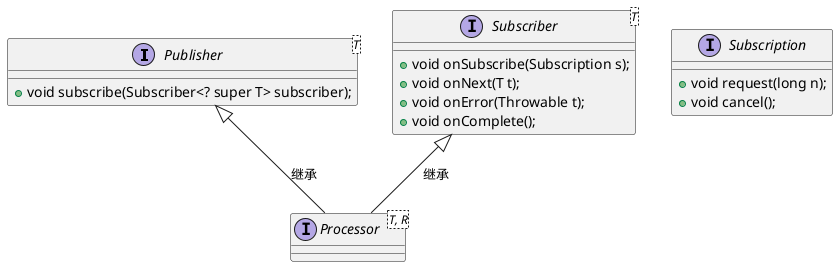
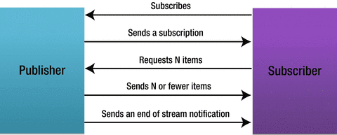

# 响应式流

响应式流是一种提供具备非阻塞背压的异步流处理倡议。主要应用在运行时环境（JVM,JavaScript）和网络协议中。

需要注意的是流操作的精确特性（转化，分割，合并等）并没有被这个规范包括。响应式流只关心在不同的API组件间调节流数据。在他们的开发中，已经非常细心地确保所有组合流的基本方式都能够被表达。

# 接口规范

响应式流特点

1. 具有处理无限数量的元素的能力；
2. 按序处理；
3. 异步地传递元素；
4. 必须实现非阻塞的回压（backpressure）。

处理流程

> `onSubscribe onNext* (onError | onComplete)?`

 这意味着onSubscribe方法总是被调用，后面跟着一个可能的无限数量onNext方法调用（因为订阅者的请求）。如果失败的话，后跟一个onError方法调用，或当没有更多的元素可用时，是一个onComplete方法调用，只要这个Subscription（订阅关系）没有被取消。

# JDK9 实现

 JDK9中 反应式流的默认实现`SubmissionPublisher`

1. 订阅者向发布者订阅（`subscribe`）时，发布者会启动一个线程来处理订阅。默认使用`ForkJoinPool`,也可以指定`Executor`。
2. 发布者通过`offer`,`submit`方法生产元素,后者是阻塞方法，前者通过`timeout`或者`BiPredicate`实现非阻塞。
3. 发布者从线程池中取出线程向订阅者传递令牌（`onSubscribe`）。
4. 发布的元素缓存在每个订阅者对应的发布者缓存队列中。默认队列容量256。
5. 订阅者通过令牌请求元素（`request`）。
6. 当缓存队列满时，发布者可能阻塞，或者重试，或者丢弃元素。

# Reactor 实现

早期响应式流规范没有提出的时候RxJava是响应式编程的先驱，为异步编程提供了便利。后来响应式流规范出现，RxJava 2在改进RxJava 1的同时尽量向规范靠拢。但是因为历史兼容的原因，很多地方使用得并不直观。Reactor 则是完全基于反应式流规范设计和实现的库，没有 RxJava 那样的历史包袱，在使用上更加的直观易懂。Reactor 也是 Spring 5 中反应式编程的基础。JDK 9 完全移植了Reactor 接口。

## Flux 和 Mono

Flux 和 Mono 是 Reactor 中的两个基本概念。Flux 表示的是包含 0 到 N 个元素的异步序列。在该序列中可以包含三种不同类型的消息通知：正常的包含元素的消息、序列结束的消息和序列出错的消息。当消息通知产生时，订阅者中对应的方法 onNext(), onComplete()和 onError()会被调用。Mono 表示的是包含 0 或者 1 个元素的异步序列。该序列中同样可以包含与 Flux 相同的三种类型的消息通知。Flux 和 Mono 之间可以进行转换。对一个 Flux 序列进行计数操作，得到的结果是一个 Mono<Long>对象。把两个 Mono 序列合并在一起，得到的是一个 Flux 对象。

## 操作符

`buffer` 把流中元素缓冲到集合中，并把集合返回成为新的流。相当于分组。

`filter`对流中包含的元素进行过滤，只留下满足 Predicate 指定条件的元素。

`window`作用类似于 buffer，所不同的是 window 操作符是把当前流中的元素收集到另外的 Flux 序列中

`zipWith`把当前流中的元素与另外一个流中的元素按照一对一的方式进行合并。在合并时可以不做任何处理，由此得到的是一个元素类型为 Tuple2 的流。

`take `系列操作符用来从当前流中提取元素。指定提取方式，可以按照时间数量间隔，或者具体判断条件。

`reduce`累计操作，处理结果和下一元素进行合并。可指定初始值。

`merge` 两个流合并成为一个流，交叉合并。也可以按流为单位，前后合并。

`flatMap`把流中的每个元素转换成一个流，再把所有流中的元素进行合并。

`concatMap `也是把流中的每个元素转换成一个流，再把所有流进行合并。与 `flatMap` 不同的是，`concatMap` 会根据原始流中的元素顺序依次把转换之后的流进行合并

`combineLatest `把所有流中的最新产生的元素合并成一个新的元素，作为返回结果流中的元素。只要其中任何一个流中产生了新的元素，合并操作就会被执行一次，结果流中就会产生新的元素。

## 消息处理

可以通过 `subscribe` 方法来添加相应的订阅逻辑。指定正常处理逻辑和异常处理逻辑。

可以通过`onErrorReturn`来指定发生错误时的默认值。

`switchOnError`指定发生错误时返回的新流。

`onErrorResumeWith`根据异常类型，来返回不同的新流。

`retry`根据指定次数重新订阅流。

## 调度器

指定这些操作执行的方式和所在的线程。

- 当前线程，通过 `Schedulers.immediate()`方法来创建。
- 单一的可复用的线程，通过` Schedulers.single()`方法来创建。
- 使用弹性的线程池，通过 `Schedulers.elastic()`方法来创建。线程池中的线程是可以复用的。当所需要时，新的线程会被创建。如果一个线程闲置太长时间，则会被销毁。该调度器适用于 I/O 操作相关的流的处理。
- 使用对并行操作优化的线程池，通过 `Schedulers.parallel()`方法来创建。其中的线程数量取决于 CPU 的核的数量。该调度器适用于计算密集型的流的处理。
- 使用支持任务调度的调度器，通过 `Schedulers.timer()`方法来创建。
- 从已有的 `ExecutorService` 对象中创建调度器，通过 `Schedulers.fromExecutorService()`方法来创建。

通过 `publishOn()`和 `subscribeOn()`方法可以切换执行操作的调度器。其中 `publishOn()`方法切换的是操作符的执行方式，而 `subscribeOn()`方法切换的是产生流中元素时的执行方式。

## “冷”与“热”序列

冷序列指的是无论订阅者在何时订阅都能看到全部的流元素。热序列指的是订阅者只能看到订阅之后的流元素，订阅前产生的元素会丢失。`autoConnect`方法生成一个热序列。

# 反应式流对比

composable：组合性，使得各位使用者很便利地使用函数式编程的思想去思考问题。

lazy:延迟执行

reusable:可重用

async:异步执行

cached:缓存执行结果

push:push模式

back-pressure:回压, *支持回压的前提是 pipeline 必须是推模型。*

operator-fusion:操作符熔合是响应式编程领域最尖端的研究话题之一，它的目的是把数据流中使用的多个操作符以某种方式结合起来，进而降低开销（时间，内存）。用一个操作替换 2 个或更多的相继的操作和一个输出队列的结束操作，和在一个输入队列的开始操作，能够共享一个队列的实例时直接拉取，可以省去`request(1)`的开销。

|                     |        composable        |   lazy   | reusable |      async       |     cached     | push |     back-pressure      | operator-fusion |
| :-----------------: | :----------------------: | :------: | :------: | :--------------: | :------------: | :--: | :--------------------: | :-------------: |
|  CompletableFuture  |        thenApply?        | 直接执行 |    √     |        √         |       √        |  √   |           ×            |        ×        |
|       Stream        | `filter`,`map`,`skip`... | 终止操作 |    ×     | × `parallel` |       ×        |  ×   |           ×            |        ×        |
|      Optional       | `map`,`flatMap`,`filter` | 直接执行 |    √     |        ×         |       √        |  ×   |           ×            |        ×        |
| Observable(RxJava1) | `filter`,`map`,`skip`... |  订阅者  |    √     |        √         | √ `cached` |  √   | √ `onBackpressure` |        ×        |
| Observable(RxJava2) | `filter`,`map`,`skip`... |  订阅者  |    √     |        √         | √ `cached` |  √   |           ×            |        √        |
| Flowable(RxJava 2)  | `filter`,`map`,`skip`... |  订阅者  |    √     |        √         | √ `cached` |  √   |           √            |        √        |
|        Flux         | `filter`,`map`,`skip`... |  订阅者  |    √     |        √         | √ `cached` |  √   |           √            |        √        |

**Observable(RxJava 1), Flowable, Flux** -常用回压策略：

- Buffering - 缓冲所有的 `onNext` 的值，直到下游消费它们。
- Drop Recent - 如果下游处理速率跟不上，丢弃最近的 `onNext` 值。
- Use Latest - 如果下游处理速率跟不上，只提供最近的 `onNext` 值，之前的值会被覆盖。
- None - `onNext` 事件直接被触发，不做缓冲和丢弃。
- Exception - 如果下游处理跟不上的话，抛出异常。

