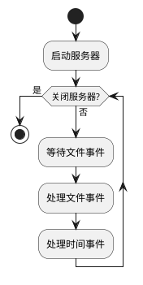
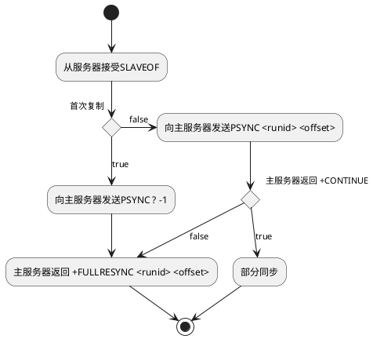
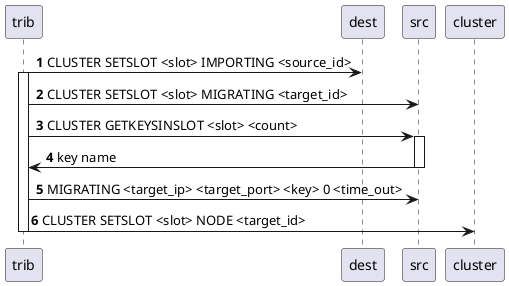
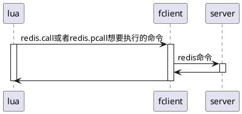

# 对象和数据结构
## 简单动态字符串

redis没有使用原生的C语言字符串实现，而是自己定义了新的数据结构简单动态字符串（Simple Dynamic String）,并且作为了字符串的默认实现。同时也用作AOF的缓冲区实现。

SDS与C字符串的主要区别在于增加了free，len两个属性分别用于保存未使用的数组空间长度和字符串的长度。free解初了字符串长度等于数组长度-1的限制，避免频繁分配内存空间。len使得对字符串求长度的算法时间复杂度由O(n)提升到O(1)，也使得SDS判断字符结束不完全依赖于空字符，这样可以安全保存二进制格式数据。二者同样采用字符数组作为真正的底层实现，SDS可以兼容部分C的函数。

SDS在需要扩容时候首先判断扩容后的数组长度是否超过1MB,如果超过则会每次增加1MB的容量，否则每次增加扩容后数组长度的容量。这种空间预分配的策略可以降低连续扩容时内存分配次数，由$\Omega(n)$降低为$O(n)$。自动扩容的封装避免了内存的溢出。

SDS在对字符串的截取操作时并没有立刻释放内存空间，而是简单的通过free记录可以被重新使用的空间。同时也提供强制释放空间的API，能在情况下以空间换取效率。

## 链表
当一个列表键包含比较多的元素或者都是长字符串时，redis会使用链表作为底层的实现。除此之外，发布订阅，慢查询，监视器的功能也用到了链表。redis服务器本身也使用链表保存客户端信息，使用链表构建客户端输出缓冲区。redis链表是一个双端链表。

## 字典
redis内部数据库就是使用字典作为实现的。除此之外，字典也是哈希的底层实现。redis的字典采用链地址法来解决哈希冲突。

当服务器没有执行`BGSAVE`、`BGREWRITEAOF`时，哈希表的负载因子大于1或者服务器执行了这两个命令，负载银子大于5时会触发哈希表的rehash扩容过程。如果负载因此小于0.1则会触发哈希表的收缩。

当哈希表数据量过大时，rehash并不是一次性完成而是分阶段渐进的完成。字典内部存在两个哈希表，一个用来保存数据，另一个只在扩容是用来复制元素，同时字典维持一个rehashindex用来记录当前复制操作元素的下标，每复制完成一个rehashindex增加1。直到全部复制完成。在此期间对字典的插入操作只放在复制目的表中，其他操作则同时在两个表中进行。避免复制的过程占用太多的服务器资源。

## 跳跃表
跳跃表的效率和平衡树相差不大，但是实现比平衡树更加简单。在redis中使用跳跃表作为有序集合的底层实现，以及集群节点中用作内部数据结构。redis跳跃表分为zskiplist和zskiplistNode两个结构组成，zskiplist只是为了整个跳跃表的便利性增加的额外结构，保存了跳跃表的头尾指针，最高层数，以及表的大小等数据。

## 整数集合
当一个集合只包含整数数值，并且元素不多时，redis会使用整数集合来做底层实现。整数集合最终通过数组来保存元素，同时通过encoding保存数组中整数的编码方式，并最终确定整数数组所占内存空间的大小。当添加的新元素类型已经超过整数数组中其他元素长度时会触发整数集合的升级。升级是一个提升encoding，扩展空间，调整元素位置的过程。升级体现了整数集合的灵活性，并可以节约内存。一旦升级之后，整数集合就不可能再降低编码长度。

## 压缩列表
压缩列表是列表和哈希的底层实现，当一个列表要么是短字符串要么是小数字时redis会采用压缩列表。如果哈希表满足以上条件，redis也会使用压缩列表来做底层实现。压缩列表是一块连续的内存地址，记录了整个列表的长度，偏移量，节点数量。每个节点记录前一个节点的长度，节点保存数据的类型和长度。

节点使用`previous_entry_length`记录前一个节点的长度，这个属性在前一个节点长度小于255时只需要占用一个1个字节长度，否则就需要占用5字节。因此当前一个字节长度变化时候可能导致连锁更新。最坏情况下连锁更新的事件复杂度为$O(n^2)$。但是极端情况并不常见，对于压缩列表的常用操作，平均时间复杂度只是$O(n)$.

## 对象
redis使用之前的数据结构来储存和表示对象，内置的5种对象系统可以在不同场景下采用不同数据结构来实现。redis的对象系统采用引用计数法来实现内存的回收，并在适当情况下多个数据库共享对象来节约内存。对象同时会携带访问时间信息，在设置了`maxmemory`的时候，空转时间长的对象会被优先删除。

redis中每个对象都是用redisObject来保存。type表示对象的类型，ptr指向具体的数据结构，encoding表明了具体的数据结构。
```plantuml
class redisObject{
    unsigned type:4
    unsigned encoding:4
    unsigned lru:22
    int refcount
    void *ptr
}
```
其中type表示的对象类型一共有5种

| 类型常量     | 对象类型 | type输出 |
| ------------ | -------- | :------: |
| REDIS_STRING | 字符串   |  string  |
| REDIS_LIST   | 列表     |   list   |
| REDIS_HASH   | 哈希     |   hash   |
| REDIS_SET    | 集合     |   set    |
| REDIS_ZSET   | 有序集合 |   zset   |

encoding表示的数据类型

|         编码常量          |        底层数据结构        | Object encoding 输出 |
| :-----------------------: | :------------------------: | -------------------- |
|    REDIS_ENCODING_INT     |       long类型的整数       | int                  |
|   REDIS_ENCODING_EMBSTR   | embstr编码的简单动态字符串 | embstr               |
|    REDIS_ENCODING_RAW     |       简单动态字符串       | raw                  |
|     REDIS_ENCODING_HT     |            字典            | hashtable            |
| REDIS_ENCODING_LINKEDLIST |          双端链表          | linkedlist           |
|  REDIS_ENCODING_ZIPLIST   |          压缩列表          | ziplist              |
|   REDIS_ENCODING_INTSET   |          整数集合          | intset               |
|  REDIS_ENCODING_SKIPLIST  |        跳跃表和字典        | skiplist             |

对象类型和底层的数据结构并不是一一对应，同一类对象不同的编码对应不同的底层数据结构。每一类对象至少都可以对应两种不同的编码。不将对象和具体的数据结构一一对应，提升了redis的灵活性和效率。

| 对象常量     | 编码                      | 数据结构                                   |
| :----------- | :------------------------ | :----------------------------------------- |
| REDIS_STRING | REDIS_ENCODING_INT        | 使用整数值实现的字符串                     |
| REDIS_STRING | REDIS_ENCODING_RMEMBSTR   | 使用embstr编码的简单动态字符串实现的字符串 |
| REDIS_STRING | REDIS_ENCODING_RAW        | 使用简单动态字符串实现的字符串             |
| REDIS_LIST   | REDIS_ENCODING_ZIPLIST    | 使用压缩列表实现的列表                     |
| REDIS_LIST   | REDIS_ENCODING_LINKEDLIST | 使用双端链表实现的列表                     |
| REDIS_HASH   | REDIS_ENCODING_ZIPLIST    | 使用压缩列表实现的哈希                     |
| REDIS_HASH   | REDIS_ENCODING_HT         | 使用字典实现的哈希                         |
| REDIS_SET    | REDIS_ENCODING_INTSET     | 使用整数集合实现的集合                     |
| REDIS_SET    | REDIS_ENCODING_HT         | 使用字典实现的集合对象                     |
| REDIS_ZSET   | REDIS_ENCODING_ZIPLIST    | 使用压缩列表实现的有序集合                 |
| REDIS_ZSET   | REDIS_ENCODING_SKIPLIST   | 使用跳跃表和字典实现的有序集合             |

redis服务器收到命令时会首先根据值对象的type属性判断命令能否执行，如果可以执行，还会根据不同数据结构采用不同的方式来实现命令。

## 内存回收
redis内建了基于引用计数的内存回收技术。每个对象的引用技术由`redisObject`结构的`refcount`属性记录。再redis启动时会自动在内存中创建0-9999的一万个字符串对象，然后在需要使用时增加引用计数，以实现对象的共享，从而节约内存。对象的引用计数可以通过`OBJECT REFCOUNT`命令来查看。使用`SET`命令创建对象后，对象的引用计数默认为2，其中1个引用是键值对的键，另一个是服务器程序。

`lru`属性记录了对象上一次被程序访问的时间。`OBJECT IDLETIME`可以计算出对象的空转时间。但这个命令比较特殊，不会修改`lru`属性。如果服务器打开了`maxmemory`并且内存的回收策略设置为`volatile-lru`或者`allkeys-lru`。当服务器内存占用超过`maxmemory`时，空转时间较长的对象会被回收。
# 单机实现
默认情况下redis启动时会创建16个数据库，每个客户端都有自己对应的数据库。在redis内部通过redisClient结构的db属性会指向客户端选择的数据库。所有数据库实例都保存在redisServer结构的db属性中。`SELECT`的原理就是修改redisClient结构db属性的指向。

redis所有的数据都是以键值对的形式存储在redisDB结构的dict属性中。这个字典被称为键空间。所有对redis服务器的增删改查操作最终都会落在对键空间的操作上。

```plantuml
class redisServer{
    int dbnum
    redisDB *db
    struct saveparam *saveparams
    long long dirty
    time_t lastsave
    sds aof_buf
    list *clients
}

class redisClient{
    redisDB *db
    int fd
    robj *name
    int flags
    sds querybuf
    robj **argv
    robj argc
    struct redisCommand *cmd
}

class redisDB{
    dict *dict
    dict *expires
}
```
对redis的读写操作会进行一些额外的操作：
1. `INFO stats`命令中的`keyspace_hits`和`keyspace_misses`结果就是在读取之后进行维护的。
2. 更新数据的lru时间
3. 读取键时发现建已经过期，那么服务器会删除这个键
4. 修改被`WATCH`的键时，会将键标记为`dirty`。
5. 服务器每次修改一个数据，都会对`dirty`键计数器增加1。这个计数器会对数据库的持久化和复制产生影响。
6. 如果配置了数据库通知，在修改之后还会发送响应的数据库通知。

## 键的过期时间
redis中可以通过4个命令来设置键的过期时间：
1.  expire 设置键的秒级生存寿命
2.  pexpire 设置键的毫秒级生存寿命
3.  expireat 设置键的秒级时间戳到期时间
4.  pexpireat 设置键的毫秒级时间戳到期时间

实际上前三个命令最终都会转换为`pexpireat`来实现功能。在redisDB中expires维护了所有键的过期时间，这个字典称之为过期字典。过期字典的键指向`dict`中的某个键，值是一个毫秒级别的unix时间戳记录了键的过期时间。`PRESIST`命令的原理就是在过期字典中移除对应的键。`TTL`命令的实现的原理就是在过期字典中获取过期时间和当前时间对比返回时间差。

## 过期键的删除

过期键的删除有三种策略：
1. 设置键过期时间的同时创建定时器，在键过期时候就删除键。这种方式最能即使删除键清理内存，但是对CPU不友好。并且redis对于时间事件实现无序链表，效率并不高。
2. 每次获取键时才判断是否过期，过期则删除。这种方式对内存不友好，如果大量过期键没有被访问到，这种情形和内存泄漏是一致的。
3. 数据库每隔一段时间扫描整个库，删除过期键。是前两种方式的折中，定期删除限制CPU的时长和频率来避免过于影响服务器对外提供服务，定期的清理也能节约相当的内存空间。所以需要合理设置定期的时长和频率。

在redis实际运行中采用的是后两种策略。其中定期删除的运行的原理为：
>在指定时间内选择一个数据库，获取数据库的过期字典，遍历过期字典发现过期数据就删除。时间到达之后函数返回。下一次选择下一个数据库。

## 持久化和复制过期键
在执行`SAVE`或者`BGSAVE`生成RDB文件时数据库会对所有键进行检查，跳过过期键。所以过期键对生成RDB文件不会产生影响。载入RDB文件时，主服务器会清理过期键，只载入未过期的键。从服务器会全部载入，但是从服务器在主从同步时会清空键空间从而避免过期键存在。

采用AOF持久化时，未被删除的过期键不会对AOF文件产生影响。但是当定期或者惰性删除触发时，会在AOF文件总追加一条`DEL`命令记录。在AOF重写时程序会检查过期键，已过期的键不会被保存到重写的AOF文件中。

在主从复制的模式中，从服务器没有检查键是否过期的功能，只要从从服务器读取数据全部直接返回。只有从主服务器查询数据时主服务器会检查键是否过期，如果过期主服务器会给从服务器同步一条DEL命令。只由主服务器来删除过期键保证主从之间的一致性。

## 数据库通知

redis 2.8以后新增的数据库通知功能，通过订阅来获取数据库种键的变化或者事件的执行情况。在对redis数据库进行操作后如果操作成功系统会调用`notifyKeyspaceEvent`函数，这个函数用来产生通知消息：
1. 检查服务器配置允许发送的通知类型
2. 如果允许发送通知，则开始构建键通知或者事件通知
3. 调用`pubsubPublishMessage`函数发送通知

## RDB 持久化
redis的RDB持久化是通过`SAVE`或者`BGSAVE`来启动的，二者最终都是调用同一个函数`rdbSave`。区别在于`SAVE`由当前进程来处理，在此期间其他的命令都不会得到响应。`BGSAVE`会开启子进程，由子进程负责持久化，服务器还能响应其他命令，但是在此期间新的`SAVE`和`BGSAVE`命令会被拒绝，为了避免父子进程同时调用`rdbSave`产生竞争。`BGREWRITEAOF`命令会被阻塞，直到`BGSAVE`完成才会被处理。但是如果`BGREWRITEAOF`先执行，`BGSAVE`则会被直接拒绝。二者都是由子进程进行大量的文件读写操作，同时执行会影响效率。

通常会设置redis为自动`BGSAVE`进行RDB持久化，`redisServer`保存了上一次执行`SAVE`时间的unix时间戳，以及修改次数，`save`参数设置的保存条件。服务器会每间隔100ms调用`serverCron`函数进行数据库维护，这个函数会遍历所有的保存参数，只要由一个参数满足就会调用`BGSAVE`命令。

| REDIS | db_version | databases | EOF | check_sum |
| ----- | ---------- | --------- | --- | --------- |

RDB第六版文件结构，目前最新的是第七版。开头是一个5字节长度的字符，保存“REDIS”,随后是一个4字节的变量是一个字符串格式的整数，记录数据库版本。databases部分记录了数据库的状态，如果数据库是空的，这一部分也是空的长度为0。EOF是一个1字节的结束标志，这里表示RDB文件的正式结束。最后的校验码是一个8字节长度的无符号整数，通过这里判断RDB文件的完整性。

databases部分结构

| SELECTDB | db_number | EXPIRETIME_MS | ms  | TYPE | key | value |
| -------- | --------- | ------------- | --- | ---- | --- | ----- |

第一部分是一个常量，程序读到这里就会调用`select`命令切换到对应的数据库。后面5个部分组成了一个有过期时间的键值对数据。EXPIRETIME_MS常量占1个字节，ms是一个带符号的8位unix时间戳整数，表示过期时间。TYPE是一个1字节的类型信息，记录了value的类型。key永远是一个字符串对象。

## AOF 持久化
AOF持久化是通过将redis中执行过的命令记录下来达到持久化的目的。当开启了AOF时，服务器在执行完命令之后会按照文本协议的格式把命令追加到`aof_buf`缓冲区中。

redis服务程序的事件循环包含文件事件和时间事件，文件事件负责处理客户端请求和响应，时间事件就是`servreCron`这类函数。再每轮事件循环之后都会调用`flushAppendOnlyFile`函数，这个函数可能会将`aof_buf`中的缓冲写入到AOF文件中，取决于`appendfsync`配置的配置，配置可能会有3个值：
1. always,将`aof_buf`中的所有内容写入并同步AOF文件。最为耗时，每次同步保证数据安全级别最高。
2. everysec，写入AOF文件，如果距离上次同步时间超过1s，则进行同步
3. no,只写入AOF文件。写入时间最长，并不主动进行同步，由操作系统来控制，所以单次同步时间最长。

服务器在启动时候会生成一个没有网络连接的伪客户端，因为redis命令只能在客户端上下文中执行。然后遍历AOF中的命令使用伪客户端执行命令。

AOF重写是对AOF文件体积的压缩，重写之后的AOF文件体积小于等于原来的AOF文件。重写的原理是对数据库中现存的键值采用尽量少的命令描述，以达到对对同一个键操作命令压缩合并的目的，重写过程并不需要对原来的AOF文件进行读取。为了避免客户端输入缓冲区溢出，重写会判断集合的元素数量，如果数量超过REDIS_REWRITE_ITEM_PER_CMD（64），则将命令拆为多条。

AOF写入也是由子进程来完成，在子进程写入文件的时候父进程处理新来的命令同时也会把命令写入到AOF缓冲区和AOF重写缓冲区。子进程写入完成后父进程会把缓冲区的内容追加的AOF文件，并替换原来的AOF文件。使得整个重写过程中父进程参与尽量少，对外提供服务收到尽量少的影响，同时保证整个写入期间新产生的命令不会丢失。

## 事件
redis使用IO多路复用模型同时监听多个套接字，在套接字产生事件后套接字放在队列中，由事件分发程序来进行有序单线程的调用不同事件处理器进行处理。

时间事件都被保存在一个链表中，每当时间时间被触发时候根据其返回值，如果是`AE_NOMORE`之外的其他整数，则调整触发时间，并将时间事件添加到链表头部。链表排序是按照事件id降序排列，但是触发事件是无序的，服务器需要遍历整个链表调用所有到期事件。

`serverCron`函数负责定期清理服务器的资源和状态，主要功能：
1. 更新服务器的各类统计信息，比如时间，内存占用
2. 清理数据库中的过期键值对
3. 关闭清理连接失效的客户端
4. AOF,RDB持久化操作
5. 如果服务器是主服务器，对从服务器定期同步
6. 如果处于集群模式，对集群同步和心跳测试

事件的调度流程：

其中等待文件事件的最大阻塞事件由最近的时间事件间隔决定，保证如果文件事件没有达到可以及时处理时间时间。对事件的处理都是有序同步原子的，不会造成抢占。文件事件的处理如果占用太长时间服务器会通过设置的阈值来将事件分为多次处理，时间事件如果需要处理IO操作也会启动子进程。因为时间事件的处理排在文件事件之后，所以时间事件的真实处理事件会比预设的晚一些。


## 客户端和服务器

客户端连接到服务器之后，服务器会使用一个链表保存所有客户端信息。需要保存的信息包括：
1. 客户端套接字描述符，-1表示伪客户端。redis服务器目前只有用于执行lua脚本和读取AOF文件会生成伪客户端，前者一直存在，而后者在服务器载入完成之后就会被关闭。
2. 客户端名字，默认为null。
3. 标志值，记录客户端角色或者执行命令的状态。
4. 指向正在使用的数据库指针，数据库号码
5. 客户端正在执行的命令以及命令实现函数的指针
6. 客户端IO缓冲区
7. 客户端复制状态信息和一些数据结构
8. 事务状态
9. 身份验证标志。0表示未认证，此时如果服务器要求了身份验证，客户端只有AUTH命令会得到响应。
10. 创建时间，最后一次通讯时间

客户端的输入缓冲区记录了客户端执行的命令，当客户端的输入缓冲区超过1GB的时候，服务器会关闭客户端连接。客户端拥有两个输出缓冲区，一个长度固定（默认16kb），用于简短回复或者错误代码。一个长度可变用于保存较长的回复。

服务器的初始化就是创建一个struct redisServer的变量用来表示服务器的状态，并设置好初始值。
1. 首先运行initServerConfig函数未服务器的数字字符串属性以及命令表设置值。
2. 开始载入配置项，配置项可以通过启动命令参数传递或者通过配置文件传递，可以修改前一步设置的默认值。
3. 配置项应用之后开始创建除了命令表之外的数据结构并分配内存。initServer函数主要负为数据结构分配内存，并打开监听端口，读取AOF文件，创建时间事件，初始化后台的IO模块（bio）
4. redisServer变量初始化完成，开始载入RDB或者AOF文件来恢复数据库内容。
5. 执行事件循环

# 多机实现

## 主从复制

通过SLAVEOF命令使一个服务器变成另一个服务器的从服务器。旧版的复制功能从SYNC命令开始，主服务器收到命令后开始使用BGSAVE命令创建RDB文件，并将在创建文件期间的所有新命令保存在缓冲区。RDB文件创建完成之后传输到从服务器供其同步数据。从服务器同步完成之后主服务器将缓冲区内保存的命令发送给送服务器保证二者数据完全一致。随后主服务器接受到的写命令都会同步传播到从服务器保证二者数据一致。

对于初次复制主服务器旧版复制机制没有问题，但是断线重连时会有效率问题。因为一旦重连后，从服务器会像初次重连一样获取RDB文件并重新读取，但是文件中大部分内容都是不必要的。同时SYNC也是一个非常耗费资源的操作主要体现在：
1. 主服务器必须使用BGSAVE创建RDB文件，消耗CPU，IO，内存，磁盘资源
2. 生成RDB文件后，传输过程中会消耗大量的网络资源。
3. 从服务器接受到RDB文件读取内容的时候会被阻塞

为了解决旧版复制效率的问题，redis 2.8开始采用PSYNC取代了SYNC。PSYNC在重连同步时不再发送整个RDB文件，而是只将断线期间的命令发送给从服务器。

PSYNC命令需要维护一个命令缓冲区，两个偏移量。服务器每次运行都会生成一个40位16进制的runID。主从首次同步后，从服务器会保存主服务器的runID。随后主服务器传播命令后增加偏移量，并将命令写入到由固定长度的队列实现的缓冲区。从服务器收到命令后也增加偏移量，保证两个偏移量一致，则说明状态一致。从服务器重连后，发送PSYNC和服务器的runID，如果runID一致，说明仍然是断线之前的主服务器，此时主服务器检查缓冲区内偏移量，如果从服务器的偏移量仍在缓冲区范围内，则采用部分同步，只发送短线期间的命令。否则全量同步，生成RDB文件。


SLAVEOF执行过程：
1. 在redisServer中保存主服务器的ip和端口号
2. 建立到主服务器的socket连接，成为主服务器的客户端。
3. ping主服务器，如果收不到正常回复则断开重建socket连接
4. 如果主从双方都需要认证，则开始认证。否则或者认证失败断开重建socket连接。
5. 向主服务器发送从服务器的端口号，主服务器会将端口号保存。
6. 向主服务器发送PSYNC，开始数据复制。此后主服务器也成为从服务器的客户端。
7. 主服务器向从服务器传播命令

建立其主从复制之后，从服务器每隔一段时间会向主服务器发送REPLCONF ACK \<offset\>。这个命令有3个作用：
1. 检测心跳
2. 保护主服务器，作为min-slaves选项的实现。如果延迟超过配置，主服务器不再执行写命令。
3. 检测广播是否丢失，如果偏移量不对，则说明有命令在传播过程中丢失，主服务器会重新发送命令。

## 哨兵模式

哨兵启动的流程：
1. 初始化redis服务器
2. 替换redis代码为哨兵代码
3. 初始化哨兵状态，保存在sentinelState结构
4. 读取配置文件，设置监视的主服务器列表
5. 创建向主服务器的socket连接。一个命令连接，用于向主服务器发送命令，一个订阅连接。

```plantuml

class sentinel{
  uint64_t current_epoch
  dict *masters
  int tilt
  mstime_t tilt_start_time
  mstime_t previous_time
  list *scripts_queue
}

class sentinelRedisInstance{
  int flags
  char *name
  char *runid
  uint64_t config_enpoch
  sentielAddr *addr
  mstime_t down_after_period
  int quorum
  int parallel_syncs
  mstime_t failover_timeout
}
```

哨兵每间隔10s向主服务器发送一次INFO命令，获取主服务器运行信息和从服务器信息。哨兵会将主服务信息更新，并将从服务器其信息保存在主服务器实例的slaves字典，字典key为自动生成的名字ip:port,value为从服务器的实例信息。新的从服务器被发现后，哨兵会向字典中增加实例信息，并创建向从服务器的命令连接和订阅连接。所有监视相同服务器的哨兵通过同一个频道发布和订阅自身和所监视服务器的相关信息来互相通信。哨兵获得到其他哨兵的信息后，存储在服务器实例对象的sentinels字典对象中，然后互相创建命令连接。

默认情况下，哨兵每隔1s像其他服务器或者哨兵发送一次PING命令，在配置`down-after-millseconds`的时间内收不到正确回复，哨兵就会将flags增加`SRI_S_DOWN`将对应的服务器或者哨兵标记为主观下线状态。不同的哨兵可能会有不同的配置。哨兵将服务器判断为主观下线后会像其他哨兵发送`SENTIEL is-master-down-by-addr`询问服务器的状态，如果超过quorm的回复认为服务器下线，哨兵会将flags增加`SRI_O_DOWN`表示服务器进入客观下线状态。

主服务器被判断为客观下线之后，领头哨兵会被选举出来，随后由领头哨兵来对redis服务器进行故障转移。选举根据Raft算法，主要原则是先到先得，在发送`SENTIEL is-master-down-by-addr`命令的同时也会带上自己的runid，要求其他哨兵将自己设置为局部的领头。哨兵只会接受收到的第一个选举的命令。得票数超过哨兵数一般的哨兵会成为领头哨兵。如果给定的时限内没有选举出零头哨兵，一段时间后重新选举，并将选举纪元递增。

redis主服务器的故障转移分为三步:
1. 领头哨兵将一个从服务器转换为主服务器，选举过程是不断排除的过程。哨兵的从服务器列表中维护了所有的从服务器，首先删除掉下线的从服务器，然后删除掉近5s没有回复哨兵`INFO`命令的从服务器，最后删除与主服务器断线时间过长，超过`down-after-millseconds`*10的从服务器。剩下的从服务器中一次按照优先级，复制偏移量和runid来比较选出最优的从服务器。哨兵向其发送 `SLAVEOF no one`命令，并每1s一次发送`INFO`命令来判断直到`INFO`返回信息中`role`变为`master`。
2. 其他从服务器改为复制新的主服务器，发送`SLAVEOF`命令。
3. 将下线主服务器改为新主服务器的从服务器

## 集群

开启了集群特性的redis服务器都运行在只有一个节点的集群中，向一个节点node发送`CLUSTER MEET` 命令使得两个服务器开始握手，握手成功后，另一个服务器会被加入node当前的集群中。集群模式额外使用到的数据被保存到`clusterNode`,`clusterLink`,`clusterState`中。
```plantuml
class clusterNode{
  mstime_t ctime
  char name[REDIS_CLUSTER_NAMELEN]
  int flags
  uint64_t configEpoch
  char ip[REDIS_IP_STR_LEN]
  int port
  clusterLink *link
  clusterNode *slaveof
  list *fail_reports
}

class clusterLink{
  mstime_t ctime
  int fd
  sds sndbuf
  sds rcvbuf
  struct clusterNode *node
}

class clusterState{
  clusterNode *myself
  uint64_t currentEpoch
  int state
  int size
  dict *nodes
  zskiplist *slots_to_keys
  clusterNode *importing_slots_from[16384]
  clusterNode *migrateing_slots_to[16384]
}
```

redis 集群中通过槽（slot）来将数据库中的键值对分片，默认分为16384个槽。当所有槽都有节点在处理的时候集群处于上线状态，否则集群集群处于下线状态。通过`CLUSTER ADDSOLTS`命令来为节点分配槽。被分派的槽保存再节点信息`slots`数组中这是一个二进制位数组，长度为2048字节正好可以标记所有的16384个槽。节点需要处理的槽对应的二进制位为1，否则为0。所有槽的指派信息再节点和clusterState中进行了两份保存，节点中保存从节点角度保存了节点的所有槽，集群状态从槽的角度出发，记录了槽对应的节点。集群上线后，客户端发送命令会被通过CRC-16校验和来计算出待处理的数据位于哪个槽。同时将键和槽号的对应关系保存到`slots_to_keys`中如果槽应该被当前节点处理则直接处理，否则返回MOVE错误，客户端被重定向到对应节点并重新发送命令。

集群的重新分片主要通过redis集群管理软件redis-trib来实现。

1. 目标节点接受到命令后，将`importing_slots_from`对应的位置\<slot\>设置为槽对应的节点。表示当前节点正准备从对应节点导入槽。
2. 如果源节点的`migrateing_slots_to`第i个元素指向了node，则表示源节点正在将第i个槽转移到node节点。槽在转移的过程中可能会出现一部分键在目标节点一部分键在源节点的状况，如果这个时候客户端向源节点查询数据，源节点如果找不到对应的数据就会去`migrateing_slots_to`查看对应的槽是不是正在转移，如果是，就会向客户端返回一个ASK错误，客户端首先发送ASKING命令，这个命令会将客户端的标志位加上`REDIS_ASKING`标识。然后重新向目标节点请求。正常情况下，节点不处理对应的槽时，会直接返回MOVE错误，如果客户端带有`REDIS_ASKING`表示，并且当前节点的`importing_slots_from`数组显示正在导入槽，则目标节点会处理此次请求。处理之后`REDIS_ASKING`标示会被移除。

通过向节点发送命令`CLUSTER REPLICATE <nodeid>`使得节点成为主节点的从节点，从节点会在`slaveof`属性中记录主节点,然后修改flag标识，关闭`REDIS_MASTER`改为`REDIS_SLAVE`,从节点开始复制主节点数据，和SLAVEOF命令使用相同的实现。成为从节点后会通过消息传播到其他节点，其他节点会在主节点对应的`clusterNode`结构上修改`slaves`和`numslaves`属性。

节点之间通过PING命令来检测心跳，如果在指定时间内收不到对应节点的PONG响应，则发起方会将目标节点对应的clusterNode
的flags属性中打开`REDIS_NODE_PFAIL`标识，表示目标节点可能已经下线。其他节点收到疑似下线的消息后会将疑似下线报告保存在`fail_reports`中，`fail_reports`中记录了发起报告的节点以及和报告节点的最后通信时间。如果超过半数主节点都认为某一个节点疑似下线，则将疑似下线标识修改为`REDIS_NODE_FAIL`,并向整个集群广播，所有收到消息的其他节点都会立刻将对应节点标记为下线。

当从节点得知自己的主节点已经被标记为下线时，会向集群广播一条消息`CLUSTERMSG_TYPE_FAILOVER_AUTH_REQUEST`,要求所有收到消息并具有选举权的节点选举自己成为新的主节点。如果主节点尚未投票则它会响应一条`CLUSTERMSG_TYPE_FAILOVER_AUTH_ACK`表示自己支持从节点变为新的主节点。获取半数以上投标的从节点会成为新的主节点，同时将投票计数增加1。如果没有半数以上的支持者，则重新开始新一轮投票。选举方式同样是RAFT算法。获取多数支持的从节点会执行`SLAVEOF no one`来将自己变成主节点，将原主节点处理的槽全部指派给自己，最后发送PONG命令向集群通知已经故障转移完成，开始接受并处理自己相关槽的命令。原主节点如果重新上线会成为新主节点的一个从主节点。

集群之中所有节点通过Gossip协议传递消息来进行通信，主要包括：
1. MEET消息，当客户端要求执行`CLUSTER MEET`命令时，服务器会向目标节点发送MEET消息，要求对方加入自己的集群。
2. PING消息，每个节点每隔1s都会随机选择5个其他节点，向其中最久没有发送PING消息的节点发送PING消息检测其是否在线，同时也会向最后一次收到PONG消息时间超过`cluster-node-timeout`一半的节点发送PING消息，以及时更新对方的消息。
3. PONG消息，当节点收到前两类消息时会发送PONG消息表示自己已经收到了。同时也可以通过PONG消息来要求其他节点立即刷新关于自己的状态。
4. FAIL消息，当一个主节点判断另一个节点已经下线，就会发送FAIL消息收到消息的节点会将对应节点立刻标记为下线。
5. PUBLISH消息，当节点接受到PUBLISH命令时，节点会立刻执行这个命令并向集群广播一条PUBLISH消息。接受到消息的节点执行相同的命令。

# 其他特性

## 发布订阅
redis将所有的订阅状态都保存在服务器状态的`pubsub_channels`字典属性里。键是频道，值是订阅的客户端链表。所有的模式订阅则保存在`pubsub_patterns`链表中，链表中每个元素是一个pubsubPattern结构的对象，这个结构有两个属性，一个客户端，一个订阅模式。

当使用`PUBLISH`命令发布消息时，redis会查找`pubsub_channels`中保存对应频道的订阅者，遍历订阅者推送消息。然后遍历`pubsub_patterns`为符合订阅模式的客户端推送消息。

redis 2.8之后新增加了PUBSUB命令,这个命令的3给子命令都是通过遍历`pubsub_channels`或者`pubsub_patterns`来返回订阅频道相关的信息。

## 事务

执行MULTI命令之后会在redisClient的flags属性中打开`REDIS_MULTI`属性。随后的命令除非是`MULTI` `WATCH` `DISCARD` `EXEC`,否则服务器并不执行命令，而是将命令保存在队列中，返回`QUEUED`。`EXEC`命令会遍历任务队列，执行命令，返回结果。

`WATCH`命令会在redisDB的`watched_keys`字典里保存一个键值对，键是被watch的数据库键，值所有观察目标键的客户端链表。所有对数据库进行修改的命令在执行之后都会调用`touchWatchKey`函数来检查观察字典，如果修改了客户端观察的键，则会打开对应客户端flags的`REDIS_DIRTY_CAS`标识，当服务器接受到`EXEC`命令时会检查`REDIS_DIRTY_CAS`标识，如果标识已经被打开，服务器就会拒执行事务。

## Lua脚本

redis服务器会创建一个修改过的lua环境，然后保存再redisServer的lua属性中。lua环境创建步骤：
1. 创建一个基础的Lua环境
2. 载入多个基础的函数库
3. 创建全局表格redis，包含了操作Redis的函数
4. 替换lua自身的随机函数，避免副作用
5. 创建排序辅助函数，对于无序列表排序，消除命令的不确定性
6. 创建redis.pcall的错误报告函数
7. 禁止修改全局变量
8. 修改后的lua环境保存在lua属性中



`lua_scripts`字典的key保存了lua脚本的SHA1校验和，value保存了对应的lua脚本。所有被`EVAL`或者`SCRIPTS LOAD`的lua命令都保存到字典里。`SCRIPT EXISTS`命令基于`lua_scripts`字典实现。脚本的管理通过以下4个命令来实现：
1. `SCRIPT FLUSH`，清除并重建`lua_scripts`字典，关闭并新建一个lua环境
2. `SCRIPT EXISTS`，根据输入的SHA1校验和判断对应的函数是否存在
3. `SCRIPT LOAD`，在服务器中创建lua函数，保存校验和
4. `SCRIPT KILL`，如果设置了`lua-time-limit`lua函数执行时会启动一个函数用于检测lua函数运行是否超时，并接受客户端的`SCRIPT KILL`命令结束未进行写入操作的函数。如果函数执行过写入，只能通过`SHUTDOWN nosave`来停止服务器。

在主从服务器之间复制的时候`EVAL`,`SCRIPT FLUSH`,`SCRIPT LOAD`像其他命令一样会通过广播传递给从服务器，并在从服务器上执行一遍。而`EVALSHA`命令不同。主服务器采用一个字典`repl_scriptcache_dict`保存所有已经传递给从服务器的lua函数的SHA1校验和，并且每当有新的从服务器上线时会清空整个字典。如果某个SHA1存在于`lua_scripts`但不存在`repl_scriptcache_dict`中，如果主服务器执行`EVALSHA`命令，从服务器就会出现找不到命令的情况，此时会将SHA1还原成lua函数，将`EVALSHA`命令转换为等价的`EVAL`命令。如果SHA1存在于`repl_scriptcache_dict`，则主服务器直接传播`EVALSHA`命令。

## 慢查询日志

慢查询日志使用链表实现的队列保存，`slowlog-max-len`限制了队列的长度，容量满了之后旧的数据会被删除然后插入新的数据。`slowlog-log-slower-than`指定了慢查询的微秒标准。

服务器每次执行命令前后都会记录一个微秒时间，并将命令执行时长传递给`slowlogPushEntryIfNeeded`函数，这个函数首先检查函数执行是否超时，如果超时则会创建一条慢查询日志放在redisServer的slowlog链表中，然后检查链表长度，如果链表超长则删除最后一个节点。